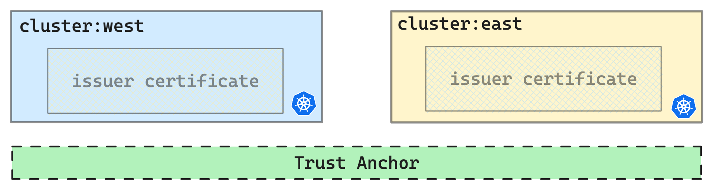

# DOKS: Multi-Cluster, Multi-Region Setup using Linkerd Service Mesh

Multi-cluster Kubernetes refers to managing multiple Kubernetes clusters, which are groups of nodes working together to orchestrate and run containerized applications. These clusters can be distributed across different data centers, regions, or cloud providers to ensure high availability, fault tolerance, and better performance.

Multi-cluster Kubernetes offers several advantages in specific scenarios:

* **Scaling and High Availability:**  By distributing workloads across clusters, it can handle increased traffic and workload demands. If one cluster fails, applications seamlessly switch to another, minimizing downtime.
* **Geographical Distribution:** Clusters in different locations ensure localized data processing, compliance with regulations, and meeting data sovereignty requirements.
* **Isolation and Resource Allocation:** Applications with varying resource needs, critical workloads, or distinct security/compliance requirements can be deployed in separate clusters. This ensures optimal resource usage and prevents interference between workloads.
* **Application and Environment Segmentation:** Multi-cluster Kubernetes supports separating development, testing, staging, and production environments. This segregation allows better control, isolation, and independent work among teams. Changes in one environment have minimal impact on others, minimizing risks.

## Service Mesh Solution

[Service Mesh](https://glossary.cncf.io/service-mesh/) frameworks are dedicated infrastructure layers to simplify the management and configuration of micro-service-based applications in a distributed system. Service meshes introduce a sidecar container as a proxy to provide multiple features (i.e., secure connections with mutual TLS, circuit breaking, canary deployments).

Some of the most popular service mesh architectures ([Istio](https://istio.io/latest/about/service-mesh/), [Linkerd](https://linkerd.io/)) have multi-cluster support to embrace multi-cluster microservices applications. The interconnection among different clusters uses a dedicated proxy to route traffic from the mesh of one cluster to another. Similarly, Istio and Linkerd can create an ad-hoc mutual TLS tunnel across clusters and provide primitives to expose services across the clusters, enabling cross-cluster communication and traffic-splitting features.

## Multi-cluster DOKS setup using Linkerd

In this POC, we will use the [Multi-cluster extension](https://linkerd.io/2.13/features/multicluster/) of Linkerd to set up a secure cross-cluster communication.

<p align="left">

</p>

### Prerequisites

We need to install some CLI tools to set up the POC successfully.

* [doctl](https://docs.digitalocean.com/reference/doctl/how-to/install/)
* [kubectl](https://kubernetes.io/docs/tasks/tools/install-kubectl/)
* [step](https://smallstep.com/docs/cli/install/)
* [linkerd](https://linkerd.io/2/getting-started/)

### Prepare the environment

Open a `terminal` and let's go!

### DOKS cluster creation

```console
# Create DOKS Cluster in "sfo3(west)"
doctl kubernetes cluster create west --region sfo3 --count 3 --size s-8vcpu-16gb

# Update the kubeconfig
doctl kubernetes cluster kubeconfig save <cluster-id>

# Rename the context to "west" for ease of demo
kubectl config rename-context do-sfo3-west west

# Create DOKS Cluster in "syd1(east)"
doctl kubernetes cluster create east --region syd1 --count 3 --size s-8vcpu-16gb

# Update the kubeconfig
doctl kubernetes cluster kubeconfig save <cluster-id>

# Rename the cluster context to "east" for ease of demo
kubectl config rename-context do-syd1-east east
```

### Set Trust Anchor

Linkerd requires a shared trust anchor between the installations in all clusters that communicate with each other. This encrypts the traffic between clusters and authorizes requests that reach the gateway so your cluster is not open to the public internet.

```console
# Generate trust anchor "root certificate and key.”
step certificate create root.linkerd.cluster.local root.crt root.key \
  --profile root-ca --no-password --insecure

# The trust anchor we’ve generated is a self-signed certificate 
# which can be used to create new certificates (a certificate authority). 
# Generate the "issuer credentials" using the trust anchor.
step certificate create identity.linkerd.cluster.local issuer.crt issuer.key \
  --profile intermediate-ca --not-after 8760h --no-password --insecure \
  --ca root.crt --ca-key root.key
```

<p align="left">

</p>

[For more details »](https://linkerd.io/2.13/tasks/generate-certificates/#trust-anchor-certificate)

## Install Linkerd(+CRDs) and Extensions

> Note: The commands in the following section will assume that you renamed the contexts to `west` and `east.`

```bash
# Install "Linkerd CRDs" on both clusters `east ` and `west.`
linkerd install --crds | tee \
    >(kubectl --context=west apply -f -) \
    >(kubectl --context=east apply -f -)

# Install "Linkerd with identity configuration" on both clusters
linkerd install \
  --identity-trust-anchors-file root.crt \
  --identity-issuer-certificate-file issuer.crt \
  --identity-issuer-key-file issuer.key \
  | tee \
    >(kubectl --context=west apply -f -) \
    >(kubectl --context=east apply -f -)
```

### Multicluster and Visualization extension

Two components implement Linkerd’s multi-cluster functionality:

* `Service mirror`:  This component watches a target cluster for updates to services and mirrors that service updates locally on a source cluster. This provides visibility into the service names of the target cluster so that applications can address them directly.

* `Gateway`: This component provides target clusters with a way to receive requests from source clusters.

```bash
# Install multicluster components on both clusters
for ctx in west east; do
  linkerd --context=${ctx} multicluster install | \
  kubectl --context=${ctx} apply -f - 
done
```

[linkerd-viz](https://github.com/linkerd/linkerd-viz) is a monitoring application based on Prometheus and Grafana, autoconfigured to collect metrics from linkerd.

```bash
# Install linkerd-viz extension on both the clusters
for ctx in west east; do
  linkerd --context=${ctx} multicluster install | \
  kubectl --context=${ctx} apply -f - || break
  linkerd --context=${ctx} viz install | \
  kubectl --context=${ctx} apply -f - || break
done
```

To link `west` to `east,` a *credentials secret, Link resource, and service-mirror controller* are created. The credentials secret includes a kubeconfig for accessing the east cluster's Kubernetes API. The `Link` resource configures service mirroring with gateway settings and label selectors. The service-mirror controller utilizes the Link and secret to identify and copy matching services from the east cluster to the west cluster.

```bash
linkerd --context=east multicluster link --cluster-name east | \
kubectl --context=west apply -f -
```

> In this case, we would like cluster `west` to mirror the services from cluster `east` so the **service mirror** component is installed only on the `west` cluster.

<p align="left">

</p>

## Install Demo Microservice Application

A three-tier [microservice application](https://github.com/BuoyantIO/emojivoto/tree/main) is used for demo purposes.

```bash
# Install the emojivoto microservice application
for ctx in west east; do
  echo "Adding emojivoto services on the cluster: ${ctx} ........."
  kubectl config use-context ${ctx}
  linkerd inject https://run.linkerd.io/emojivoto.yml | kubectl apply -f -
  echo "-------------"
done

# Delete specific deployments and services in the west cluster(for demo purposes)
kubectl --context=west -n emojivoto delete deploy voting web emoji
kubectl --context=west -n emojivoto delete svc voting-svc web-svc emoji-svc

# Delete certain deployments in the east cluster(for demo purpose)
kubectl --context=east -n emojivoto delete deploy vote-bot
```

<p align="left">

</p>

## Service mirroring in action

The *service mirror* is a Kubernetes Operator. Once installed, it mirrors a remote cluster’s services locally to provide service discovery and allow pods to refer to the remote services. It also manages **configuring endpoints** so that traffic goes to the correct IP address.

Services are not automatically mirrored in linked clusters. Only services with the **mirror.linkerd.io/exported** label will be mirrored by default.

```bash
# Label web-svc for service-mirroring
# For more details: https://linkerd.io/2020/02/25/multicluster-kubernetes-with-service-mirroring/
kubectl --context=east label svc -n emojivoto web-svc mirror.linkerd.io/exported=true

# Get endpoint IP of web-svc-east in the west cluster
kubectl --context=west -n emojivoto get endpoints web-svc-east \
  -o 'custom-columns=ENDPOINT_IP:.subsets[*].addresses[*].ip'

# Get the IP of the linkerd-gateway service in the east cluster
kubectl --context=east -n linkerd-multicluster get svc linkerd-gateway \
  -o "custom-columns=GATEWAY_IP:.status.loadBalancer.ingress[*].ip"
```

<p align="left">

</p>

## Secure cross-cluster communication

> mTLS (mutual Transport Layer Security) is an extension of regular TLS (Transport Layer Security) that ensures the server and the client are authenticated. By default, TLS only authenticates the server, but mTLS establishes mutual authentication, making the authenticity of both parties symmetric.

By default, requests will be going across the public internet. Linkerd extends its **automatic mTLS** across clusters to ensure that the communication going across the public internet is *encrypted*.

To verify `mTLS`:

```bash
linkerd --context=west -n emojivoto viz tap deploy/vote-bot | \
  grep "$(kubectl --context=east -n linkerd-multicluster get svc linkerd-gateway \
    -o "custom-columns=GATEWAY_IP:.status.loadBalancer.ingress[*].ip")"
```

Output(check **tls=true**):

```bash
req id=19:0 proxy=out src=10.244.1.114:44966 dst=134.209.136.167:4143 "tls=true" :method=GET :authority=web-svc.emojivoto.svc.cluster.local:80 :path=/api/list
rsp id=19:0 proxy=out src=10.244.1.114:44966 dst=134.209.136.167:4143 "tls=true" :status=200 latency=18381µs
```

 Linkerd enables mutually-authenticated Transport Layer Security (mTLS) for all TCP traffic between meshed pods. There are exceptions where non-mTLS traffic may still exist, such as traffic to or from pods outside the mesh (e.g., Kubernetes health checks) or traffic on ports designated as skip ports, bypassing the Linkerd proxy.

[mTLS deep-dive »](https://buoyant.io/mtls-guide)

### Activate service traffic

To demonstrate the traffic flow between the two clusters across two different regions, we need to make the following changes:

```bash
# Retrieve the clusterIP of `web-svc-east.`
kubectl --context=west -n emojivoto get svc web-svc-east -o=jsonpath='{.spec.clusterIP}' && echo

# Edit vote-bot deployment in the west cluster to point to web-svc-east
# Replace <clusterIP> with the IP obtained from the previous command
kubectl set env deployment/vote-bot -n emojivoto WEB_HOST=<clusterIP>:80 --context west
```

Now the `deployment/vote-bot` forwards the requests to `svc/web-svc-east` whose endpoints are configured to point to the *EXTERNAL-IP* of the `linkerd-gateway` on the *east* cluster.

<p align="left">

</p>

### Monitoring the traffic flow

We will now use the linkerd-viz dashboards to monitor the cross-cluster service communication.

```bash
# Open and inspect Linkerd dashboards for both clusters
linkerd viz dashboard --context west --port 50750 &
linkerd viz dashboard --context east --port 50760 &
```

The built-on linkerd dashboard below shows the *live calls* and *route metrics* between the `deployment/vote-bot` and `svc/web-svc-east`(mirrored) on the cluster `east`:

<p align="left">

</p>

The built-on linkerd dashboard below shows the *live calls* and *route metrics* between the `deployment/linkerd-gateway` and `svc/web-svc` on the cluster `west`:

<p align="left">

</p>

### End-to-end flow

The following figure depicts the **secure end-to-end flow** between the services in cluster `west` to the services in cluster `east`:

<p align="left">

</p>

> After you are done experimenting run [**./cleanup.sh**](./assets/scripts/clean-up.sh) to uninstall all the linkerd components on your cluster. 

## Key takeaways

* A comprehensive and practical guide for setting up a secure, efficient multi-cluster, multi-region environment using DigitalOcean Kubernetes (DOKS) and the Linkerd
* Leverage the power of multi-cluster Kubernetes to scale the applications, ensure high availability, meet data sovereignty requirements, and optimize resource allocation.
* The tutorial highlights the benefits of using a service mesh, which simplifies the management and configuration of microservices-based applications in distributed systems.
* Establish secure cross-cluster communication using mutual TLS encryption, and enable service mirroring for efficient service discovery.
* Insights into monitoring and visualizing the traffic flow between clusters using Linkerd's built-in visualization dashboards.

As technology continues to evolve, multi-cluster setups are becoming increasingly important for handling modern application requirements. With the guidance provided in this tutorial, readers can navigate the complexities of multi-cluster environments and unlock the full potential of their Kubernetes deployments.
